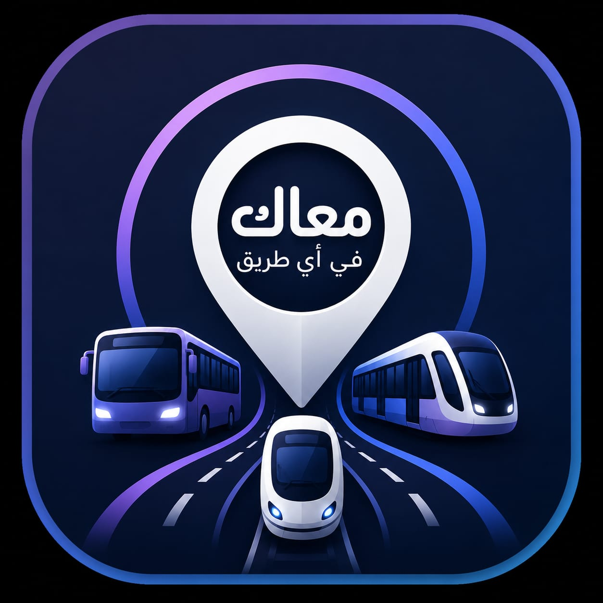

# دليلك | المنصة الشاملة للمواصلات

## 📝 وصف المشروع
مشروع "دليلك" هو منصة ويب تفاعلية صُممت لتسهيل معرفة مسارات المواصلات المختلفة في مكان واحد. التطبيق يوفر للمستخدم واجهة عصرية وسلسة للاختيار بين خدمات المترو، قطار العاصمة، ومواقف السفر.

## ✨ مميزات المشروع
* تجربة مستخدم تفاعلية وسلسة.
* مؤثرات صوتية ترحيبية.
* تصميم متجاوب يعمل بكفاءة على جميع الشاشات.

## 🛠️ التقنيات المستخدمة
* HTML5
* CSS3
* JavaScript